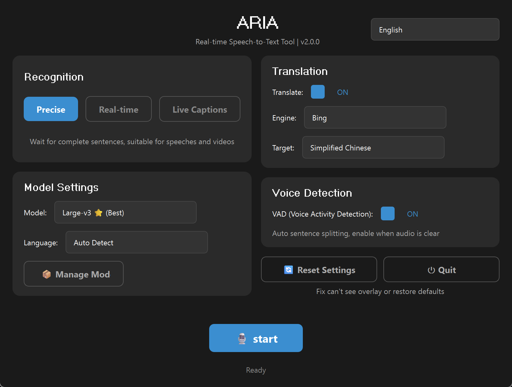
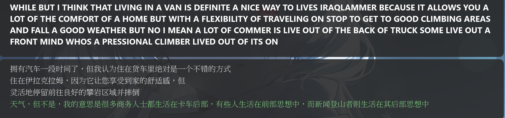

# ARIA v2

<p align="center">
  <strong>AI Realtime Intelligent Audio</strong>
</p>

<p align="center">
  
  
</p>
**Universal Real-time AI Subtitles for Windows** - Capture and transcribe any audio playing on your system with AI-powered speech recognition.

## Features

- **Universal Audio Capture** - Works with any application (games, videos, calls, etc.)
- **Three Recognition Modes**:
  - **Precise Mode**: Uses Whisper for high-accuracy transcription (NVIDIA GPU recommended)
  - **Realtime Mode**: Uses Sherpa-ONNX/Vosk for word-by-word streaming (CPU/GPU)
  - **LiveCaptions Mode**: Uses Windows 11 built-in AI (✅ **No GPU/CUDA required**, works on AMD/Intel/NVIDIA)
- **Multi-language Support**: Chinese, English, Japanese, Korean, and more
- **Real-time Translation**: Translate transcriptions with Google Cloud or NLLB (local)
- **Customizable Overlay**: Draggable subtitle window with adjustable position
- **Multilingual UI**: English, Traditional Chinese, Simplified Chinese
- **Embedded Python**: No separate Python installation required

## System Requirements

### 🟢 ARIA Lite (Recommended)
**Perfect for most users. Zero configuration.**
*   **OS**: Windows 11 (version 22H2 or later)
*   **Hardware**: Any standard laptop or PC (Intel/AMD/NVIDIA)
*   **No specific GPU or CUDA required.**

---

### 🔷 ARIA Full (Pro / Offline)
**For users needing high-precision offline transcription.**

*   **OS**: Windows 10 or 11
*   **GPU**: NVIDIA GTX 10 series or newer (Recommended for best speed)
*   **Storage**: ~10 GB free space

## Download

### Choose Your Version

| Version | Size | Description | Google Drive | Baidu |
|---------|------|-------------|--------------|-----------------------------|
| **Lite** 【Recommended】 | ~600 MB | **Best for most users.** Lightweight, fast, accurate, works on ANY GPU (AMD/Intel). **Requires Windows 11 (22H2 or later).** | [Google Drive](https://drive.google.com/drive/folders/1rRQrj0IPX7rnQxA30WvmxhH-5c6fWZa8?usp=drive_link) | [Baidu](https://pan.baidu.com/s/1KkSlAv7X5yi90hTYuWZoPQ?pwd=j5ip) |
| **Full** | ~7.6 GB | All Modes (Precise/Realtime/Live). Offline models pre-installed. | [Google Drive](https://drive.google.com/drive/folders/1rdxunARIa3-68VV4xAKlbzh_dv_wI130?usp=drive_link) | [Baidu](https://pan.baidu.com/s/1yGc-pU6DdPFw8po60ubI3w?pwd=r2m6) |

### Full Version Included Models

| Model | Type | Size | Languages |
|-------|------|------|-----------|
| Whisper Large-v3 | Precise | 3 GB | All |
| Sherpa-ONNX Bilingual | Realtime | 500 MB | Chinese, English |
| Vosk Japanese | Realtime | 1 GB | Japanese |
| NLLB Translation | Translation | 1.2 GB | Many |

## Quick Start

1. Download and extract the ZIP file
2. Double-click **`ARIA.bat`**
3. **Lite Version**: Ready to use immediately (Live Captions only).
4. **Full Version**: Select mode and click **Start**.

## Configuration

### Recognition Modes

| Mode | Engine | Best For | GPU Requirement |
|------|--------|----------|----------------|
| **Precise** | Whisper | Speeches, videos, pre-recorded content | NVIDIA recommended |
| **Realtime** | Sherpa-ONNX / Vosk | Live conversations, streaming | CPU/GPU |
| **LiveCaptions** | Windows 11 AI | **General Use (Movies/Meetings)** | ✅ Any CPU / GPU (No NPU needed) |

### Supported Languages

| Language | Precise Mode | Realtime Mode | LiveCaptions Mode |
|----------|--------------|---------------|------------------|
| Chinese (中文) | ✅ | ✅ (Sherpa-ONNX) | ✅ |
| English | ✅ | ✅ (Sherpa-ONNX) | ✅ |
| Japanese (日本語) | ✅ | ✅ (Vosk) | ✅ |
| Korean (한국어) | ✅ | ❌ | ✅ |
| Spanish, French, etc. | ✅ | ❌ | ✅ |
| + 50 more | ✅ | ❌ | ❌ |

> **LiveCaptions Mode**: Supports 11 languages via Windows 11 built-in AI. No model download required!

### Translation

**Local Models (Offline):**
- **NLLB-200**: Meta's multilingual translation model, supports 200+ languages, runs locally

**Online Services (Free APIs):**

- **Google Translate**: Fast and accurate, via web scraping
- **Bing Translator**: Microsoft's translation service
- **Youdao**: 有道翻譯 (specialized for Chinese-English translation)

>  **Note**: Online services use web scraping and may be subject to rate limiting. Local NLLB model recommended for reliability.

## Package Structure

```
ARIA/
├── python/          # Embedded Python (no installation needed)
├── src/             # Source code
├── models/          # AI models (Full version only)
├── ARIA.bat         # Launcher
```

## Screenshots





## License

This project is licensed under the **GNU General Public License v3.0** - see the [LICENSE](LICENSE) file for details.

## Acknowledgments
- [Faster Whisper](https://github.com/SYSTRAN/faster-whisper)
- [Sherpa-ONNX](https://github.com/k2-fsa/sherpa-onnx)
- [Vosk](https://alphacephei.com/vosk/)
- [PyQt6](https://www.riverbankcomputing.com/software/pyqt/)
- [PyAudioWPatch](https://github.com/s0d3s/PyAudioWPatch)

## Contact

- GitHub: [@sayksii](https://github.com/sayksii)
- Email: mark42967151@gmail.com
